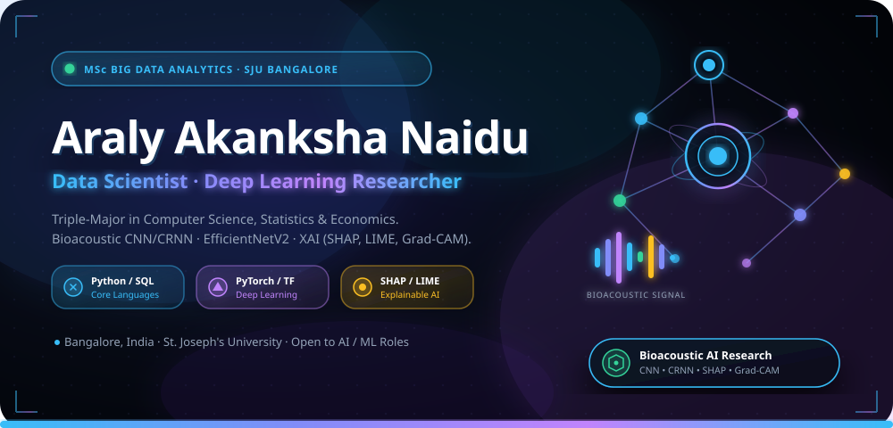

<!-- ══════════════════════════════════════════════════
     CINEMATIC 3D HEADER BANNER
══════════════════════════════════════════════════ -->

 

<!-- Animated Typing SVG -->

  

<!-- Social / Status Pills -->
&nbsp;
&nbsp;
&nbsp;
&nbsp;

 

## ⚡ About Me

<table width="100%">
<tr>
<td width="60%" valign="top">

> *"Turning complex data into clear, explainable, and practical AI solutions."*

I am an **MSc Big Data Analytics student** at **St. Joseph's University, Bengaluru**, with a multidisciplinary background in **Computer Science, Statistics, and Economics** from Andhra Loyola College.

Skilled in Python, SQL, Pandas, NumPy, and Scikit-learn — with hands-on experience in data analysis, machine learning, NLP, predictive modeling, Generative AI, and AI-driven applications. Currently exploring **Explainable AI and Deep Learning** for healthcare and bioacoustic research.

</td>
<td width="40%" align="center" valign="top">

**🎯 Quick Summary**

| | |
|:--|:--|
| 🎓 Degree | MSc Big Data Analytics |
| 🏛️ University | St. Joseph's Univ., Bengaluru |
| 🧠 Focus | ML · Generative AI · XAI |
| 📈 Highlight | 92.46% Emotion Classification |
| 🤖 AI Tools | Google AI · Prompt Engineering |
| 🌍 Location | Bengaluru, India |

</td>
</tr>
</table>

## 🛠️ Tech Stack & Skills

 

**Programming & Data Analysis** 

 

**Machine Learning & NLP** 

 

**Generative AI & AI Tools** 

 

**Big Data, Databases & Visualization** 

 

**Explainable AI · Tools** 

## 💡 How I Build AI Models

## 🚀 Key Projects

<table width="100%">
<tr>
<td width="50%" valign="top">

### 🎭 Emotion Classification from Text
**NLP & Machine Learning · 92.46% Accuracy**

Built a machine learning model using Python and Scikit-learn, achieving **92.46% accuracy** in emotion classification. Applied TF-IDF, lexicon-based features, Logistic Regression, and Naive Bayes. Deployed with a Streamlit web interface with live prediction and visualization dashboards.

> *End-to-end NLP pipeline — from raw text to a live interactive dashboard.*

</td>
<td width="50%" valign="top">

### 💡 Explainable AI for Healthcare
**XAI · Deep Learning · Risk Prediction**

Explored Deep Learning and Explainable AI (XAI) approaches for healthcare risk prediction and interpretable decision support. Investigated Grad-CAM-based explainability, uncertainty estimation, and model interpretability to build transparent AI systems.

> *Making AI predictions trustworthy, transparent, and interpretable.*

</td>
</tr>

<tr>
<td width="50%" valign="top">

### 🚚 Smart Logistics Route Optimization
**Autonomous Delivery Route Simulation**

Developed a simulation model for autonomous delivery systems using Python, OSMnx, NetworkX, and Streamlit. Implemented Dijkstra's Algorithm with dynamic routing factoring in weather, traffic, and vehicle constraints.

> *Simulates optimal delivery paths under real-world urban conditions.*

</td>
<td width="50%" valign="top">

### 🐾 PawKart — AI Pet Retail Platform
**Demand Forecasting · AI/ML Internship**

Contributed to an AI-powered pet retail platform, building demand forecasting models, recommendation systems, and inventory analytics. Applied feature engineering, ML prototyping, and collaborated on UI/UX design and go-to-market strategy.

> *Real-world AI product development in a cross-functional team.*

</td>
</tr>

<tr>
<td width="50%" valign="top">

### 👩‍💼 Women Employment Job Platform
**Statistical Job Matching · SheWorks**

Developed a job search platform to help less-educated women identify suitable employment opportunities. Applied statistical analysis, data interpretation, and candidate-job matching to connect user profiles with relevant roles.

> *Data-driven recommendations for improving employment accessibility.*

</td>
<td width="50%" valign="top">

### 🏙️ Geospatial & Recommendation Analytics
**Data Visualization · PyDeck · Plotly**

Built geospatial analytics and recommendation system projects using PyDeck, Plotly, and Streamlit, exploring interactive data visualization and location-intelligence for business analytics use cases.

> *Turning location data into interactive, actionable visual insights.*

</td>
</tr>
</table>

## 📊 Live GitHub Activity

<table border="0" cellpadding="8">
<tr>
<td>

</td>
<td>

</td>
</tr>
<tr>
<td colspan="2" align="center">

</td>
</tr>
</table>

 

 

**🐍 Contribution Graph**

## 🎓 Education, Experience & Certifications

<b>🎓 Academic Qualifications</b>

 

| Degree | Institution | Year | Performance |
|:--|:--|:--|:--|
| **MSc Big Data Analytics** | St. Joseph's University, Bengaluru | 2025 – Present | Pursuing |
| **BSc (CS, Statistics, Economics)** | Andhra Loyola College, Vijayawada | 2025 | CGPA 7.09 |

<b>💼 Work & Internship Experience</b>

 

**🤖 AI/ML Intern — Comedkares Innovation Hub, Bengaluru**
- Contributed to **PawKart**, an AI-powered pet retail platform, supporting demand forecasting, recommendation systems, inventory management, and data-driven retail solutions.
- Performed data preprocessing, feature engineering, exploratory analysis, and model development to build practical AI/ML prototypes.
- Applied Python, machine learning, and data visualization techniques to analyze retail data and generate actionable insights.
- Collaborated on empathy mapping, ideation, prototyping, and UI/UX development; contributed to go-to-market strategy.

**📈 Business Development Specialist Intern — Younity Community Pvt. Ltd.**
- Conducted market research and business analysis to identify customer segments and growth opportunities.
- Analyzed market data to support lead generation and strategic decision-making.
- Assisted in developing business expansion strategies and outreach initiatives.

<b>🏆 Leadership & Achievements</b>

 

| Role | Organization | Achievement |
|:--|:--|:--|
| 🏀 **Basketball Team Member** | Andhra Loyola College | **1st Place** — Inter-Collegiate (Year 1) · 2nd Place (Year 2) |
| 👔 **Class Representative** | Andhra Loyola College | 3 consecutive years as faculty-student liaison |
| 🎭 **President, Entertainment Club** | Andhra Loyola College | Planned and managed student cultural events |
| 📢 **Communication Coordinator** | AICUF Student Council | Managed communications across student council |
| 📣 **Marketing Team** | Metaminds, SJU | Managed promotional activities for department events |
| 🎲 **Volunteer** | TTOX Board Games Expo | Event coordination and attendee management |

<b>📜 Certifications & Interests</b>

 

**Certifications**
- 🤖 Google AI Essentials — Google, Coursera
- 💬 Google Prompting Essentials — Google, Coursera
- 🧠 AI & Generative AI Certification Program — Indian Institute of Creative Technologies (IICT)
- 🍃 Introduction to MongoDB for Students — MongoDB University
- 📊 Excel: Basic to Advanced — Younity.in
- 📱 Digital Marketing — Younity.in

**Hobbies & Interests**
> Board Games &nbsp;·&nbsp; Basketball &nbsp;·&nbsp; Dancing &nbsp;·&nbsp; Singing &nbsp;·&nbsp; Meditation

### 📫 Let's Connect!

&nbsp;
&nbsp;

  

*"Turning raw data into clear, explainable, and high-impact AI solutions."*

 

