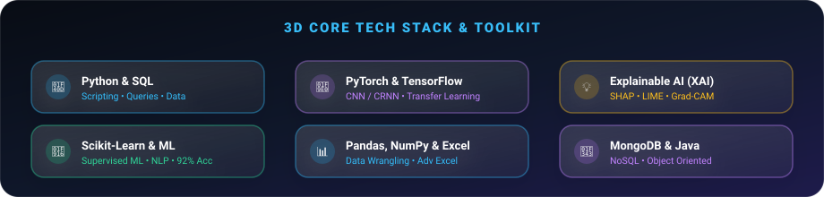

<!-- ══════════════════════════════════════════════════
     CINEMATIC 3D HEADER BANNER
══════════════════════════════════════════════════ -->

 

<!-- Animated Typing SVG -->

  

<!-- Social / Status Pills -->
&nbsp;
&nbsp;
&nbsp;
&nbsp;

 

## ⚡ Philosophy & Who I Am

<table width="100%">
<tr>
<td width="60%" valign="top">

> *"I believe every model must not only perform — it must explain itself. My work lives at the intersection of deep learning, bioacoustics, and transparency."*

I am a **Data Scientist and MSc Big Data Analytics student** at **St. Joseph's University, Bangalore**, with a rare triple-major foundation in **Computer Science, Statistics, and Economics** from Andhra Loyola College.

I design end-to-end intelligent systems — from raw bioacoustic recordings to CNN/CRNN classifiers, to Explainable AI layers that surface *why* a model behaves the way it does. I combine mathematical rigour, software engineering, and analytical thinking to solve problems that matter.

</td>
<td width="40%" align="center" valign="top">

**🎯 Quick Stats**

| | |
|:--|:--|
| 🎓 Degree | MSc Big Data Analytics |
| 🏛️ University | St. Joseph's Univ., Bangalore |
| 🧠 Focus | Bioacoustic AI · XAI · DL |
| 📈 Best Result | 92% NLP Classification Accuracy |
| 🏀 Achievement | Inter-Collegiate Basketball Champion 🥇 |
| 🌍 Location | Bangalore, India |

</td>
</tr>
</table>

## 🛠️ Tech Stack & Expertise

 

**Languages & Databases** 

 

**Deep Learning & ML** 

 

**Explainable AI · Data Science** 

## 💡 The AI → XAI Pipeline

## 🚀 Best Work — Project Showcase

<table width="100%">
<tr>
<td width="50%" valign="top">

### 🐝 Beehive Health Monitoring
**Bioacoustic Deep Learning · In Progress**

Developing a **CNN/CRNN audio classification system** to detect queen bee presence and hive health anomalies from raw bioacoustic recordings. Core challenge: cross-hive generalization across diverse real-world environmental conditions.

> *Impact: Supports sustainable pollination and precision agriculture.*

</td>
<td width="50%" valign="top">

### 🏛️ Architectural Building Classifier
**EfficientNetV2 Transfer Learning**

End-to-end computer vision pipeline for architectural building category classification using fine-tuned **EfficientNetV2** with advanced transfer learning techniques to achieve high precision.

> *Demonstrates applied transfer learning in real-world visual domains.*

</td>
</tr>

<tr>
<td width="50%" valign="top">

### 🎭 Emotion Classifier from Text
**NLP · Scikit-Learn · 92% Accuracy**

Supervised text classification model achieving **92% accuracy** in detecting emotional sentiment from written content. Paired with a live web interface and real-time prediction visualization dashboard.

> *Showcases NLP pipeline mastery end-to-end.*

</td>
<td width="50%" valign="top">

### 🚚 Smart Logistics Optimization
**AI-Driven Autonomous Delivery**

Urban shortest-route optimization simulation using **Dijkstra's Algorithm** with dynamic simulation of weather, temperature, and wind variables affecting autonomous delivery vehicle performance.

> *Demonstrates algorithmic thinking applied to smart city challenges.*

</td>
</tr>

<tr>
<td width="50%" valign="top">

### 👩‍💼 SheWorks — Women Employment Engine
**Statistical Job Matching Platform**

Statistical matching engine connecting under-resourced women to suitable employment opportunities. Multi-variable demographic and skill-gap analysis drives personalised job recommendations.

> *Statistics applied for measurable social equity impact.*

</td>
<td width="50%" valign="top">

### 🐾 PawKart — AI Pet Retail
**Demand Forecasting · Comedkares Internship**

Contributed to PawKart, an AI-powered pet retail platform, building demand forecasting models, empathy-mapped UI/UX prototypes, and go-to-market strategy during a 5-week intensive AI/ML internship.

> *Real-world cross-functional team experience in AI product development.*

</td>
</tr>
</table>

## 📊 Live GitHub Intelligence

<table border="0" cellpadding="8">
<tr>
<td>

</td>
<td>

</td>
</tr>
<tr>
<td colspan="2" align="center">

</td>
</tr>
</table>

 

 

**🐍 Contribution Matrix**

## 🎓 Education, Experience & Leadership

<b>🎓 Academic Qualifications</b>

 

| Degree | Institution | Year | Result |
|:--|:--|:--|:--|
| **MSc Big Data Analytics** | St. Joseph's University, Bangalore | 2025 – Present | Pursuing |
| **BSc — CS, Statistics, Economics** | Andhra Loyola College, Vijayawada | 2025 | CGPA 7.09 |
| **Class XII (ISC)** | Loyola School, Jamshedpur | 2022 | 74% |
| **Class X (ICSE)** | Loyola School, Jamshedpur | 2020 | 76% |

<b>💼 Work Experience</b>

 

**🤖 AI/ML Intern — Comedkares Innovation Hub, Bangalore** *(5 weeks)*
- Contributed to **PawKart** AI pet retail platform across demand forecasting, UI/UX, and GTM strategy.
- Applied data preprocessing, feature engineering, and model development to build production AI prototypes.
- Cross-functional collaboration via empathy mapping, ideation sprints, and rapid prototyping.

**📈 Business Development Specialist — Younity Community Pvt Ltd**
- Market research and business data collection to support client acquisition and expansion strategy.

**👥 HR Team Leader — Younity Community Pvt Ltd**
- Led and managed a team of **40 interns**, coordinating tasks and ensuring workflow efficiency.
- Delivered onboarding, training, and performance monitoring for new team members.

<b>🏆 Leadership, Awards & Extracurriculars</b>

 

| Role | Organization | Achievement |
|:--|:--|:--|
| 🏀 **Basketball Player** | Andhra Loyola College | **1st Place** — Inter-Collegiate (Year 1) · 2nd Place (Year 2) |
| 👔 **Class Representative** | Andhra Loyola College | 3 consecutive years as faculty-student liaison |
| 🎭 **President, Entertainment Club** | Andhra Loyola College | Led cultural events and student engagement |
| 📢 **Communication Coordinator** | AICUF Student Council | Cross-faculty communication and council management |
| 📣 **Marketing Team** | Metaminds, SJU | Promotional and event management initiatives |
| 🎲 **Volunteer** | TTOX Board Games Expo | Event coordination and attendee management |

<b>📜 Certifications & Interests</b>

 

**Certifications**
- 📊 Excel: Basic to Advanced — Younity.in
- 📱 Digital Marketing — Younity.in
- 🍃 Introduction to MongoDB for Students — MongoDB University

**Hobbies & Interests**
> Board Games &nbsp;·&nbsp; Basketball &nbsp;·&nbsp; Dancing &nbsp;·&nbsp; Singing &nbsp;·&nbsp; Meditation

### 📫 Let's Build Something Remarkable Together

&nbsp;
&nbsp;

  

*"Transforming raw data into transparent, explainable, and high-impact AI intelligence."*

 

