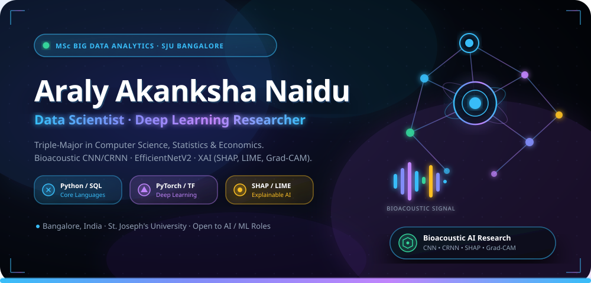
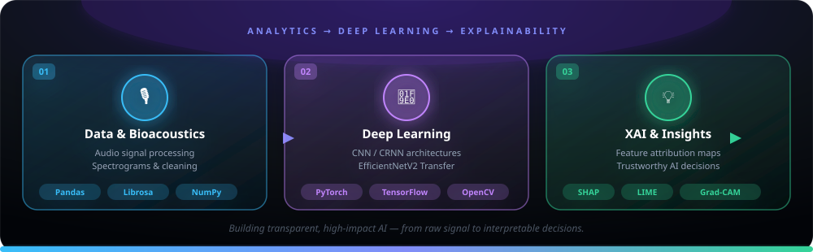

  <!-- 3D Glassmorphic Master Header -->
  

    

  <!-- Dynamic Animated Typing Header SVG -->
  

    

  <!-- Quick Action Badges -->
  

    
    
    
    
    
  

---

## ⚡ About Me & Technical Philosophy

> *"Data is a story waiting to be told—my mission is to make deep learning models transparent, interpretable, and directly actionable for real-world impact."*

I am a **Data Scientist and MSc Big Data Analytics student** at St. Joseph's University, Bangalore. With a rigorous triple-major foundation in **Computer Science, Statistics, and Economics** from Andhra Loyola College, I bridge the gap between mathematical rigor, software engineering, and analytical decision-making.

- 🎓 **Current Academic Pursuits**: MSc in Big Data Analytics @ St. Joseph's University, Bangalore.
- 🧠 **Technical Focus**: Deep Learning (CNN/CRNN architectures, Transfer Learning with EfficientNetV2), Bioacoustic Signal Classification, and Explainable AI (SHAP, LIME, Grad-CAM).
- 📊 **Analytics Pipeline**: End-to-end expertise — from raw audio/text/image data preprocessing and statistical hypothesis testing to predictive ML modeling & executive dashboarding.
- 🎯 **Career Goal**: Seeking Data Scientist / Data Analyst roles to build trustworthy, high-performing AI systems that solve complex business and scientific challenges.

---

## 🛠️ 3D Tech Stack & Toolkit

### 💻 Programming Languages & Databases

  
  
  
  
  
  

### 🤖 Deep Learning & Machine Learning

  
  
  
  
  

### 💡 Explainable AI (XAI) & Interpretability

  
  
  

### 📈 Data Science & Analytics Tools

  
  
  
  

---

## 💡 Explainable AI & Deep Learning Pipeline

  

---

## 🚀 Best Work Showcase

<table width="100%">
  <tr>
    <td width="50%" valign="top">
      <h3>🐝 Beehive Health Monitoring</h3>
      
<b>Bioacoustic Deep Learning System</b>

      <ul>
        <li>Developing a CNN/CRNN audio classification system to detect queen presence and hive anomalies from bioacoustic recordings.</li>
        <li>Addressing cross-hive generalization as a core technical challenge to ensure robust performance across diverse environmental conditions.</li>
      </ul>
      

        
        
        
      

    </td>
    <td width="50%" valign="top">
      <h3>🏛️ Architectural Building Classifier</h3>
      
<b>EfficientNetV2 Transfer Learning</b>

      <ul>
        <li>Built an end-to-end computer vision image classification pipeline for architectural building categories.</li>
        <li>Leveraged EfficientNetV2 transfer learning with fine-tuning techniques to achieve high categorical precision.</li>
      </ul>
      

        
        
        
      

    </td>
  </tr>
  <tr>
    <td width="50%" valign="top">
      <h3>🎭 Emotion Classification from Text</h3>
      
<b>Natural Language Processing & ML (92% Accuracy)</b>

      <ul>
        <li>Developed a supervised text classification model using Scikit-Learn achieving <b>92% classification accuracy</b>.</li>
        <li>Integrated a web interface & visualization dashboard to display real-time sentiment predictions.</li>
      </ul>
      

        
        
        
      

    </td>
    <td width="50%" valign="top">
      <h3>🚚 Smart Logistics Optimization</h3>
      
<b>AI-Driven Autonomous Delivery Systems</b>

      <ul>
        <li>Created a route optimization simulation model for autonomous delivery systems in urban environments using Dijkstra's Algorithm.</li>
        <li>Simulated dynamic weather, temperature, and wind constraints affecting delivery energy & route performance.</li>
      </ul>
      

        
        
        
      

    </td>
  </tr>
  <tr>
    <td width="50%" valign="top">
      <h3>👩‍💼 SheWorks – Women Employment Engine</h3>
      
<b>Statistical Job Matching Platform</b>

      <ul>
        <li>Designed a statistical matching engine to connect less-educated women to viable local employment opportunities.</li>
        <li>Applied multi-variable demographic and skill analysis to align candidate profiles with job prerequisites.</li>
      </ul>
      

        
        
        
      

    </td>
    <td width="50%" valign="top">
      <h3>🐾 PawKart AI Pet Retail Platform</h3>
      
<b>Demand Forecasting & Product Design (Comedkares)</b>

      <ul>
        <li>Contributed to PawKart, an AI pet retail platform, building demand forecasting models and empathy-mapped UI/UX prototypes.</li>
        <li>Collaborated in a cross-functional team during a 5-week intensive AI/ML internship.</li>
      </ul>
      

        
        
        
      

    </td>
  </tr>
</table>

---

## 📊 Live GitHub Metrics

  <table border="0">
    <tr>
      <td>
        
      </td>
      <td>
        
      </td>
    </tr>
    <tr>
      <td colspan="2" align="center">
        
      </td>
    </tr>
  </table>

   

  <!-- Live Activity Graph -->
  

    
  

   

  <!-- Contribution Snake GIF -->
  

    <b>🐍 GitHub Contribution Graph Matrix</b>  
    
  

---

## 🎓 Education & Professional Experience

  
🎓 <b>Educational Qualifications</b> (Click to expand)

   
  <table>
    <thead>
      <tr>
        <th>Degree / Course</th>
        <th>Institution</th>
        <th>Year</th>
        <th>Performance</th>
      </tr>
    </thead>
    <tbody>
      <tr>
        <td><b>MSc Big Data Analytics</b></td>
        <td>St. Joseph's University, Bangalore</td>
        <td>2025 – Present</td>
        <td>Pursuing</td>
      </tr>
      <tr>
        <td><b>BSc (Computer Science, Statistics, Economics)</b></td>
        <td>Andhra Loyola College, Vijayawada</td>
        <td>2025</td>
        <td>CGPA: 7.09</td>
      </tr>
      <tr>
        <td><b>Class XII (ISC)</b></td>
        <td>Loyola School, Jamshedpur</td>
        <td>2022</td>
        <td>74%</td>
      </tr>
      <tr>
        <td><b>Class X (ICSE)</b></td>
        <td>Loyola School, Jamshedpur</td>
        <td>2020</td>
        <td>76%</td>
      </tr>
    </tbody>
  </table>

  
💼 <b>Work Experience</b> (Click to expand)

   
  <ul>
    <li>
      <b>AI/ML Intern</b> — <i>Comedkares Innovation Hub, Bangalore</i> (5 weeks)
      <ul>
        <li>Contributed to PawKart, an AI-powered pet retail platform, working across demand forecasting models, UI/UX design, and go-to-market materials.</li>
        <li>Applied data preprocessing, feature engineering, and model development to build practical AI/ML prototypes.</li>
        <li>Collaborated with a cross-functional team through empathy mapping, ideation, and prototyping to translate real-world retail problems into AI-driven solutions.</li>
      </ul>
    </li>
    <li>
      <b>Business Development Specialist Intern</b> — <i>Younity Community Pvt Ltd</i>
      <ul>
        <li>Conducted market research and collected business data to support strategy development and expansion into key client segments.</li>
      </ul>
    </li>
    <li>
      <b>HR Team Leader</b> — <i>Younity Community Pvt Ltd</i>
      <ul>
        <li>Led and managed a team of 40 interns, coordinating weekly tasks and ensuring smooth team operations.</li>
        <li>Conducted onboarding and training for new interns; monitored team performance and workflow efficiency.</li>
      </ul>
    </li>
  </ul>

  
🏆 <b>Leadership &amp; Extracurricular Achievements</b> (Click to expand)

   
  <ul>
    <li>🏀 <b>Inter-Collegiate Basketball Champion</b>: 1st Place (1st Year) &amp; 2nd Place (2nd Year) representing Andhra Loyola College.</li>
    <li>👔 <b>Class Representative</b>: Served 3 consecutive years as communication liaison between faculty and students at Andhra Loyola College.</li>
    <li>📢 <b>Communication Coordinator</b>: AICUF Student Council, Andhra Loyola College.</li>
    <li>🎭 <b>President, Entertainment Club</b>: Andhra Loyola College — led planning and execution of major cultural &amp; student engagement events.</li>
    <li>📢 <b>Marketing Team Member</b>: Metaminds (St. Joseph's University) — managed promotional initiatives for departmental events.</li>
    <li>🎲 <b>Board Games Expo Volunteer (TTOX)</b>: Assisted in organizing and managing attendee activities during gaming expos.</li>
  </ul>

  
📜 <b>Certifications &amp; Interests</b> (Click to expand)

   
  <ul>
    <li>📜 <b>Excel: Basic to Advanced</b> — Younity.in</li>
    <li>📜 <b>Digital Marketing Certification</b> — Younity.in</li>
    <li>📜 <b>Introduction to MongoDB (For Students)</b> — MongoDB University</li>
    <li>🧩 <b>Interests &amp; Hobbies</b>: Board Games, Basketball, Dancing, Singing, Meditation</li>
  </ul>

---

  <h3>📫 Let's Connect &amp; Collaborate!</h3>
  
  

    
    
    
  

   

  
<i>"Transforming complex data into actionable, explainable AI intelligence."</i>

  
  

    
  

